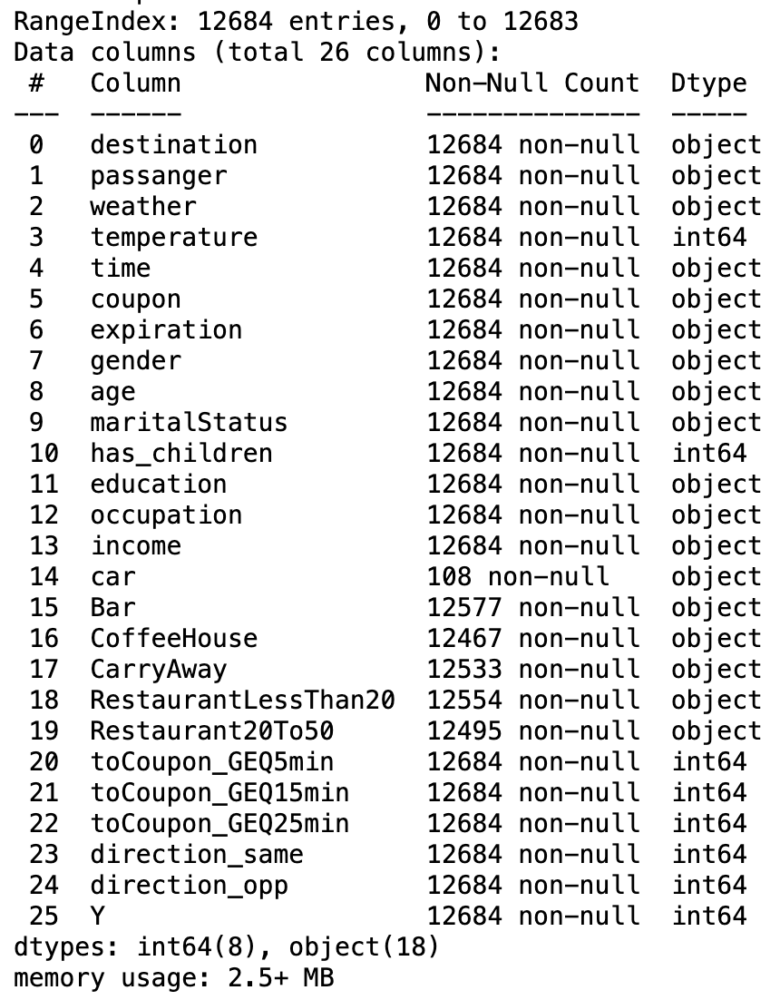
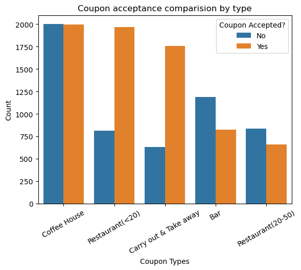
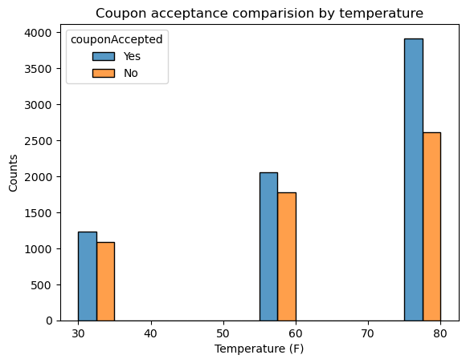
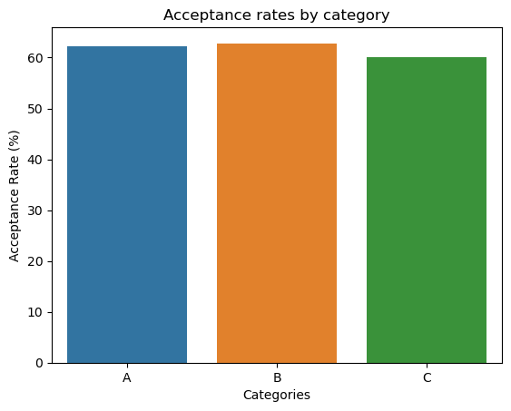
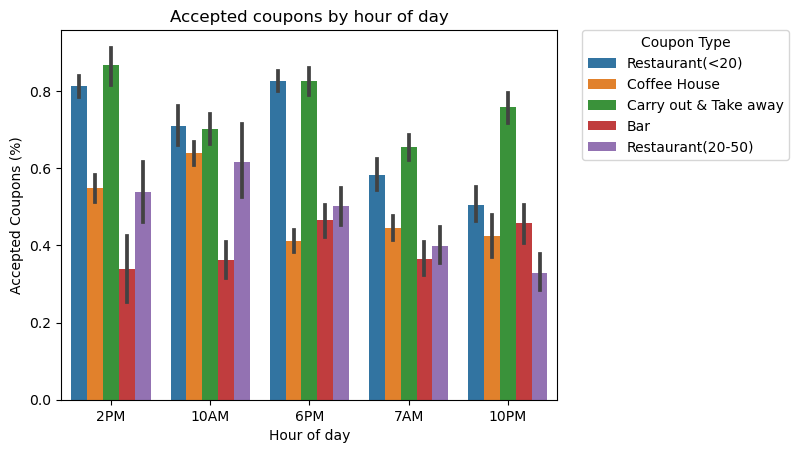
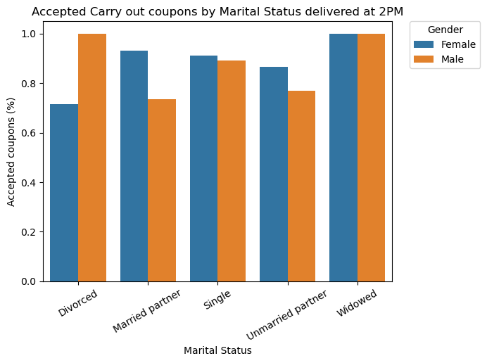
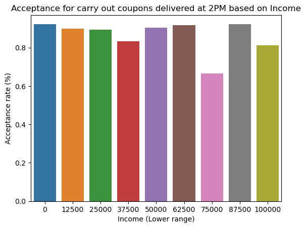
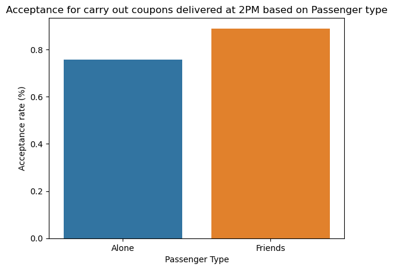

# GeoCoupon
How would you determine whether a driver is likely to accept a coupon based on location?

## Business Understanding

As a business this is necessary to optimize the acceptance rate for coupons delivered to drivers crossing near to some areas with restaurants, bars, coffee houses and others. It is important to understand what are the best conditions increasing the driver accepts the coupon at same time our busineses increase their sales and engage more people.

## Data Understanding

This data comes to us from the UCI Machine Learning repository and was collected via a survey on Amazon Mechanical Turk. The survey describes different driving scenarios including the destination, current time, weather, passenger, etc., and then ask the person whether he will accept the coupon if he is the driver. Answers that the user will drive there ‘right away’ or ‘later before the coupon expires’ are labeled as ‘Y = 1’ and answers ‘no, I do not want the coupon’ are labeled as ‘Y = 0’. There are five different types of coupons -- less expensive restaurants (under $20), coffee houses, carry out & take away, bar, and more expensive restaurants ($20 - $50).

#### User attributes

- Gender: male, female
- Age: below 21, 21 to 25, 26 to 30, etc.
- Marital Status: single, married partner, unmarried partner, or widowed
- Number of children: 0, 1, or more than 1
- Education: high school, bachelors degree, associates degree, or graduate degree
- Occupation: architecture & engineering, business & financial, etc.
- Annual income: less than $12500, $12500 - $24999, $25000 - $37499, etc.
- Number of times that he/she goes to a bar: 0, less than 1, 1 to 3, 4 to 8 or greater than 8
- Number of times that he/she buys takeaway food: 0, less than 1, 1 to 3, 4 to 8 or greater than 8
- Number of times that he/she goes to a coffee house: 0, less than 1, 1 to 3, 4 to 8 or greater than 8
- Number of times that he/she eats at a restaurant with average expense less than $20 per person: 0, less than 1, 1 to 3, 4 to 8 or greater than 8
- Number of times that he/she goes to a bar: 0, less than 1, 1 to 3, 4 to 8 or greater than 8

#### Contextual attributes

- Driving destination: home, work, or no urgent destination
- Location of user, coupon and destination: we provide a map to show the geographical location of the user, destination, and the venue, and we mark the distance between each two places with time of driving. The user can see whether the venue is in the same direction as the destination.
- Weather: sunny, rainy, or snowy
- Temperature: 30F, 55F, or 80F
- Time: 10AM, 2PM, or 6PM
- Passenger: alone, partner, kid(s), or friend(s)

#### Coupon attributes

- time before it expires: 2 hours or one day

#### Dataset Details

- RangeIndex: 12684
- entries, 0 to 12683
- Data columns (total 26 columns):

## Data Preparation

The original data has being cleaned up by doing small changes:

1. Removing the `car` column as the major of records were missed
2. Renaming columns to have a best manipulation
3. The `age` column has being normalized in the different values and converted to numeric
4. The income range has being normalized to store the lower income and converted to numeric in order to use as filtering criteria

## Data Analysis / Comparison of different columns

### What proportion of bar coupons were accepted? (4)
The proportion of bar coupons accepted is: `41.00 %`. A total of 7210 accepted coupons for the total observations of 12684 records.

### Use a bar plot to visualize the coupon column. (5)

Based on the "Coupon Types" graph above, there is a good acceptance for cheap restaurants coupons. The major of coupons delivered below this category are accepted (1970 coupons) in comparision with not accepted (816 coupons)

### Use a histogram to visualize the temperature column.(6)

Evaluating the temperature and the acceptance of coupons, this is observed the major of coupons are accepted over ambient temperature of 80 degrees

## Investigating the Bar Coupons

### What proportion of bar coupons were accepted? (2)

The proportion of bar coupons accepted is: `41.00 %`

### Compare the acceptance rate between those who went to a bar 3 or fewer times a month to those who went more. (3)
The acceptance rate for bar coupons is better when the driver has visited a bar more than 3 times having a `62.25%` of acceptance rate vs `58.79%`

- Accepted bar coupons, visits >= 1 <= 3: 58.79
- Accepted bar coupons, visits > 3: 62.25

### Compare the acceptance rate between drivers who go to a bar more than once a month and are over the age of 25 to the all others. Is there a difference? (4)
There is more acceptance over drivers visiting more than 1 time a bar and older than 25 year old (`61.74%`) vs other drivers (`55.40%`)

### Use the same process to compare the acceptance rate between drivers who go to bars more than once a month and had passengers that were not a kid and had occupations other than farming, fishing, or forestry. (5)
The acceptance rate for drivers who go to bars more than once a month and had passengers that were not a kid and had occupations other than farming is `62.31%` being better than other drivers with an acceptance of `54.59%`

### Compare the acceptance rates between those drivers who: (6)
- **Category A**: go to bars more than once a month, had passengers that were not a kid, and were not widowed OR
- **Category B**: go to bars more than once a month and are under the age of 30 OR
- **Category C**: go to cheap restaurants more than 4 times a month and income is less than 50K.

The acceptance rate between the different categories is very similar. It is around `60%` of coupons acceptance rate for each one

### What proportion of coupons were accepted based on hour of day (time)? (7.1)

Based on the observation of above graph, the major acceptance rate happens at 2PM being *Carry out & Take away* the coupon type with best acceptance rate.

### What is the acceptance rate for coupons type "Carry out & Take away"? (7.2)

The acceptance rate for Carry Out & Take away coupons is: `73.55%`

### What is the acceptance rate for coupons delivered at 2PM ? (7.3)

The acceptance rate for coupons delivered at 2PM is: `66.15%`

### What is the acceptance rate for coupons of "Carry out & Take away" were delivered at 2PM based on Marital Status? (7.4)

Based on the above graph `Widowed` people have the best acceptance rate of `100%`, however, this is a very small sample of coupons delivered for this category. From observation of the above dataframe resulting, we could observe the `female married` people have more coupons delivered and with higher acceptance rate: `93%`.

### Evaluate the acceptance rate for Carry out & Take away coupons delivered at 2PM based on income (7.5)

The acceptance rate based on Income for the coupon type *Carry out and take away* delivered at `2PM` is very uniform except for people with income between `$75000-$87499`

### Evaluate the acceptance rate for Carry out & Take away coupons delivered at 2PM based passenger (7.6)

Based on the above observation, drivers traveling with friends around 2PM have a better acceptance rate for *Carry out and take away* coupons. The acceptance rate for this group is `89%` compared with drivers traveling alone `76%`

## Summary of findinds

***Bar*** coupon group findings:

- The proportion of bar coupons accepted is: `41.00 %`
- The acceptance rate for bar coupons is better when the driver has visited a bar more than 3 times having a `62.25%` of acceptance rate vs `58.79%`
- There is more acceptance over drivers visiting more than 1 time a bar and older than 25 year old (`61.74%`) vs other drivers (`55.40%`)
- The acceptance rate for drivers who go to bars more than once a month and had passengers that were not a kid and had occupations other than farming is `62.31%` being better than other drivers with an acceptance of `54.59%`
- The acceptance rate between the different categories is very similar. It is around `60%` of coupons acceptance rate for each one

> **Conclusions for Bar coupons**:
- Once the bar coupons acceptance rate has being evaluated combining different factors, this is evident some combinations increases the rates. One of the main factors is when driver is without kids while driving with more than 1 visit to a bar, for this combination the acceptance rate is 62.31% followed by the cases when the driver has visited more than 3 times a bar. Based on this, the chances a driver accepts a coupon are tied mainly to the number of previous visits to a bar and with not kids as passenger in car, the last one is a real life factor, where kids are not allowed or considering the assumption: a bar is not a good environment for kids.

---

***Carry out & Take away*** group findings

NOTE: I started observing this group of coupons after compare the acceptance for different coupons. This comparision show us the major acceptance rate happens at 2PM being *Carry out & Take away* the coupon type with best acceptance rate during this time.

- The acceptance rate for Carry Out & Take away coupons is: `73.55%`
- The major acceptance rate happens at 2PM being *Carry out & Take away* the coupon type with best acceptance rate.
- Based on the marital status `Widowed` people have the best acceptance rate of `100%` for coupons delivered at 2PM, however, this is a very small sample of coupons delivered for this category. From observation of the above dataframe resulting, we could observe the `female married` people have more coupons delivered and with higher acceptance rate: `93%`
- The acceptance rate based on Income for the coupon type *Carry out and take away* delivered at `2PM` is very uniform except for people with income between `$75000-$87499`. For the last one it is noticed a decrease of the acceptance rate
- Drivers traveling with friends around 2PM have a better acceptance rate for *Carry out and take away* coupons. The acceptance rate for this group is `89%` compared with drivers traveling alone `76%`

> **Conclusions for Carry out & Take away coupons:**

- By exploring the above findings, this is concluded different combinations improve the acceptance for `Carry out & Take away` coupons. The major acceptance based on gender and marital status are the `female married`. Another importan criteria identified is the passenger traveling with driver, when he is in companition of `friends` there is major probability for coupon acceptance. In the real life, this could be related to lunch time when co-workers go out. 

## Notebook URL

The following is the notebook URL containing the root analysys performed over initial data. The information has being explored by generating different visualizations and applying filters. This is a good document to explore more details about the findings described here:

[GeoCoupon.ipynb](https://github.com/jaruizsys/GeoCoupon/blob/main/prompt.ipynb)